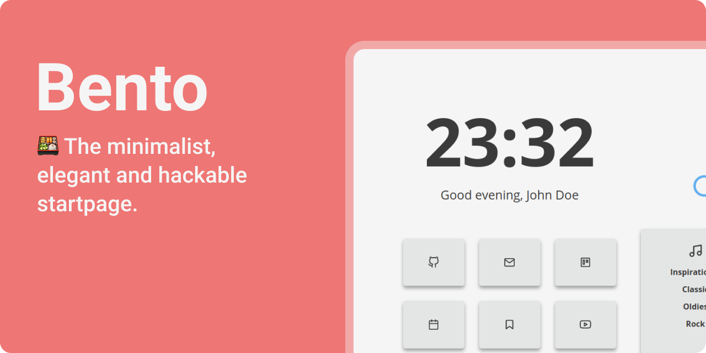
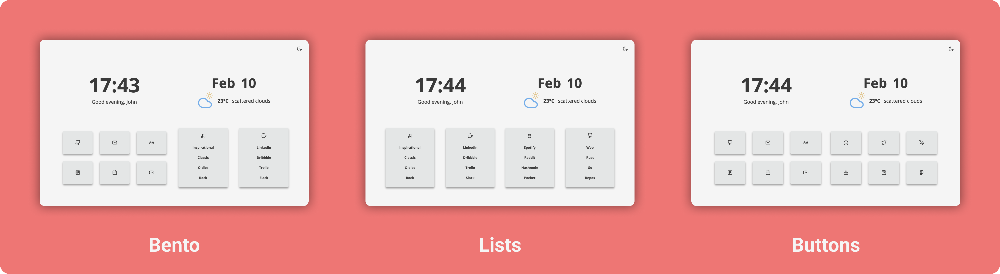
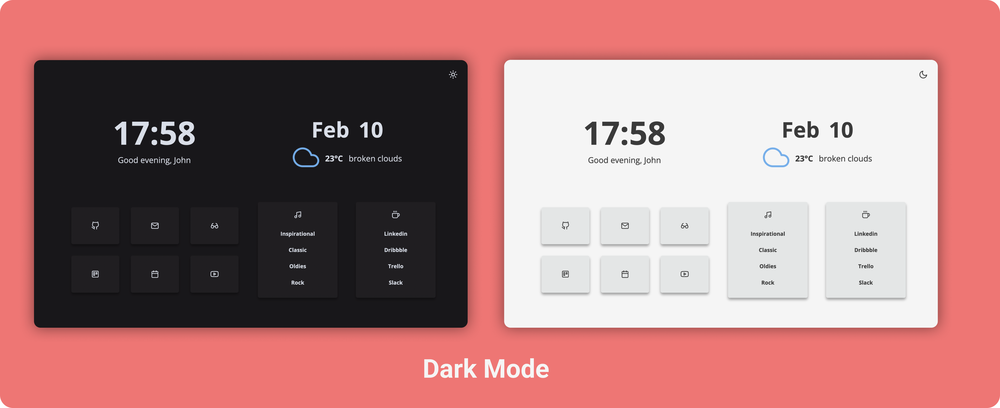

<p style="margin: -20px 0 30px">
  <a href="https://www.buymeacoffee.com/migueravila" target="_blank" style='margin-right:0px; margin-top:5px'>
    
  </a>

  <a href="https://migueravila.github.io/Bento/" target="_blank" style='margin-right:0px; margin-top:5px'>
    
  </a>
</p>

<br />

## 👇 Index
- [👇 Index](#-index)
- [✨ Features](#-features)
- [🚀 Usage](#-usage)
  - [🏡 As Home Page](#-as-home-page)
  - [➕ As New Tab](#-as-new-tab)
  - [🐬 In a Docker Container](#-in-a-docker-container)
- [🎨 Customization](#-customization)
  - [👋 General: Name, Image Background and Greetings](#-general-name-image-background-and-greetings)
  - [📐 Layouts: Bento, Lists and Buttons.](#-layouts-bento-lists-and-buttons)
  - [🏷️ Buttons & Links](#️-buttons--links)
  - [📑 Lists & Links](#-lists--links)
  - [⛈️ Weather: Api Key, Icons and Unit](#️-weather-api-key-icons-and-unit)
  - [💛 Colors](#-colors)
  - [🌑 Auto change theme](#-auto-change-theme)


## ✨ Features

- **Easy configuration** file.
- **Dark/Light** mode, you can toggle it and will be saved in local storage.
- **Layouts!** to customize your experience following your workflow.
- **Clock and Date** format can be set to 24 hour (default) or 12 hour.
- **Greetings** are easy to modify.
- **Variables** for custom colors and font sizes in the `app.css` code.
- **Icons** all icons are from [Lucide icons](https://lucide.dev).
- **Modular** javascript files for an easy read.

## 🚀 Usage

### 🏡 As Home Page

1. Fork this repo
2. Enable the Github Pages service `Settings → GitHub Pages → Source [master branch] → Save`
3. Set it as Home Page:
   - Click the menu button. and select Options. Preferences.
   - Click the Home panel.
   - Click the menu next to Homepage and new windows and choose to show custom URLs and add your `Github Pages link`

### ➕ As New Tab

You can use different Add-ons/Extensions for it

- If you use Firefox: [Custom New Tab Page](https://addons.mozilla.org/en-US/firefox/addon/custom-new-tab-page/?src=search) and make sure you enable "Force links to open in the top frame (experimental)" in the extension's preferences page.
- If you use Chromium (Brave, Vivaldi, Chrome): [Custom New Tab URL](https://chrome.google.com/webstore/detail/custom-new-tab-url/mmjbdbjnoablegbkcklggeknkfcjkjia)

### 🐬 In a Docker Container

You can run Bento in a Docker Container, either with `docker run`, or with the included `docker-compose` file.

#### Docker run
 1. Clone this repo to pull the config.js file: `git clone https://github.com/migueravila/Bento/`
 2. Run the following `docker` command, providing the path to the config.js file, changing port mappings if needed.
 3. `# docker run -it -d -p 80:80 -v <config.js location>:/usr/share/nginx/html/config.js lewisdoesstuff/bento`

#### docker-compose
  1. Clone this repo with `git clone https://github.com/migueravila/Bento/`
  2. Edit port mappings, and provide a path to the config.js file in `docker-compose.yml`
  3. `cd` into the cloned repo, then run `# docker-compose -d up` to start. 

## 🎨 Customization

All customization can be managed in the `config.js` file:

### 👋 General: Name, Image Background and Greetings

To change the default name, the greetings and if you want to have an image background or open your links in new tabs, edit the first configs in the `config.js`.

```js
 // General
  name: 'John',
  imageBackground: false,
  openInNewTab: true,

  // Greetings
  greetingMorning: 'Good morning!',
  greetingAfternoon: 'Good afternoon,',
  greetingEvening: 'Good evening,',
  greetingNight: 'Go to Sleep!',

```

> You can change the background by substituting the `background.jpg` file in `assets` folder.


### 📐 Layouts: Bento, Lists and Buttons.

Bento has three different layouts `bento`, `lists` & `buttons`. It allows you to cutomize your experience giving you more buttons or lists depending on how are you more comfortable. To modify the laout you need to change the following line in the `config.js` file:

```js
  // Layout
  bentoLayout: 'bento', // 'bento', 'lists', 'buttons'

```

If you want to customize all your extra buttons and lists go to [🏷️ Buttons & Links](#️-buttons--links) & [📑 Lists & Links](#-lists--links) sections.



### 🏷️ Buttons & Links

To edit the buttons you just need to change the follow list in the `config.js` file by choosing a link, an icon from [Lucide icons](https://lucide.dev) and a name. If you're using the `buttons` [layout](#-layouts-bento-lists-and-buttons) you can customize `secondButtonsContainer`

```js
  firstButtonsContainer: [
    {
      id: '1',
      name: 'Github',
      icon: 'github',
      link: 'https://github.com/',
    },
    {
      id: '2',
      name: 'Mail',
      icon: 'mail',
      link: 'https://mail.protonmail.com/',
    },
    {
      id: '3',
      name: 'Todoist',
      icon: 'trello',
      link: 'https://todoist.com',
    },
    {
      id: '4',
      name: 'Calendar',
      icon: 'calendar',
      link: 'https://calendar.google.com/calendar/r',
    },
    {
      id: '5',
      name: 'Reddit',
      icon: 'glasses',
      link: 'https://reddit.com',
    },
    {
      id: '6',
      name: 'Odysee',
      icon: 'youtube',
      link: 'https://odysee.com/',
    },
  ],
```

### 📑 Lists & Links

The same happens with the list links, you can change the list icon (also using Lucide icons) and the links. If you're using the `lists` [layout](#-layouts-bento-lists-and-buttons) you can customize `secondListsContainer`, you can find it bellow `firstListsContainer`.

```js
   firstlistsContainer: [
    {
      icon: 'music',
      id: '1',
      links: [
        {
          name: 'Inspirational',
          link: 'https://www.youtube.com/watch?v=dQw4w9WgXcQ',
        },
        {
          name: 'Classic',
          link: 'https://www.youtube.com/watch?v=dQw4w9WgXcQ',
        },
        {
          name: 'Oldies',
          link: 'https://www.youtube.com/watch?v=dQw4w9WgXcQ',
        },
        {
          name: 'Rock',
          link: 'https://www.youtube.com/watch?v=dQw4w9WgXcQ',
        },
      ],
    },
    {
      icon: 'coffee',
      id: '2',
      links: [
        {
          name: 'Linkedin',
          link: 'https://www.youtube.com/watch?v=dQw4w9WgXcQ',
        },
        {
          name: 'Dribbble',
          link: 'https://www.linkedin.com',
        },
        {
          name: 'Trello',
          link: 'https://www.trello.com',
        },
        {
          name: 'Slack',
          link: 'https://www.slack.com',
        },
      ],
    },
  ],
```

### ⛈️ Weather: Api Key, Icons and Unit

For setting up the Weather widget you'll need an API Key from: `https://openweathermap.org/`. Once you have your Key you'll need to set your latitude and longitude, you can use: `https://www.latlong.net/` to get them. 

Finally, choose an Icon set:


- **Nord** Using the Nord Color Scheme and easy-to-eyes colors
- **OneDark** (_Default one_) Using the One Dark Pro color scheme
- **Dark** For White theme only users that want a minimalist look
- **White** For Dark theme only users that want a minimalist look

Finally just add them to the `config.js` file.

```js
  // Weather
  weatherKey: 'InsertYourAPIKeyHere123456',
  weatherIcons: 'OneDark',
  weatherUnit: 'C',
  weatherLatitude: '37.774929',
  weatherLongitude: '-122.419418',
```

### 💛 Colors

In the `app.css` file you can change the variables for both themes (Dark and Light):

```css
/* Light theme  */

:root {
  --accent: #61b0f1; /* Hover color */
  --bg: #f5f5f5; /* Background color */
  --sbg: #e4e6e6; /* Cards color */
  --fg: #3a3a3a; /* Foreground color */
  --sfg: #3a3a3a; /* Sceondary Foreground color */
}

/* Dark theme  */

.darktheme {
  --accent: #61b0f1; /* Hover color */
  --bg: #19171a; /* Background color */
  --sbg: #201e21; /* Cards color */
  --fg: #d8dee9; /* Foreground color */
  --sfg: #3a3a3a; /* Secondary Foreground color */
}
```

### 🌑 Auto change theme

The theme can be automatically changed by the OS' current theme or personalized hours
that you can change in the `config.js` file:

```js
  // Autochange
  autoChangeTheme: true,

  // Autochange by OS
  changeThemeByOS: false, 

  // Autochange by hour options (24hrs format, string must be in: hh:mm)
  changeThemeByHour: true, // If it's true, it will use the values below:
  hourDarkThemeActive: '18:30', // Turn on the dark theme after this hour
  hourDarkThemeInactive: '07:00', // Turn off the dark theme after this hour and before the above hour
```


